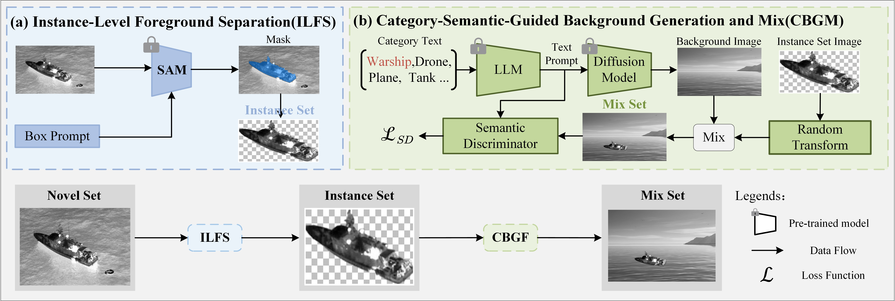

# SFBDA: A Semantic-Decoupled Data Augmentation Framework for Infrared Few-Shot Object Detection on UAVs

## Abstract
Few-shot object detection (FSOD) is a critical frontier in computer vision research. However, the task of infrared(IR) FSOD presents significant technical challenges, primarily due to (1) few annotated training samplfes and (2) the lowtexture nature of thermal imaging. To address these issues, we propose a Semantic-guided Foreground-Background Decoupling Augmentation (SFBDA) framework. This method includes an instance-level foreground separation module that utilizes spectral clustering to extract discriminative object prototypes, as well as a semantic-constrained background generation network that employs adversarial learning to synthesize contextually compatible backgrounds. To address the insufficiency of scenario diversity in existing (unmanned aerial vehicle)UAV-based IR object detection datasets, we introduce MSIR-UAVDET, a novel multi-scene IR UAV detection benchmark. This dataset encompasses 16 object categories across diverse environments (terrestrial, maritime, aerial). To validate the efficacy of the proposed data augmentation methodology, we integrated our approach with existing fewshot object detection frameworks and comparative experiments were conducted to benchmark our method with existing data augmentation methods.

## Dataset

#### Describtion
MSIR-UAVDET is a multi-scene infrared UAV detection dataset.

#### How to get it
Download **MSIR-UAVDET** upon request. You may use the request form to request access to the dataset according to [Request.md](https://github.com/Sea814/SFBDA/blob/main/Request.md).

## Method

### ILFS
### CBGM
The Difussion model can git at[model link](https://drive.google.com/file/d/1QNvLqB7PeRcRy75jWxunYbMXFTrHdFKM/view?usp=drive_link).
